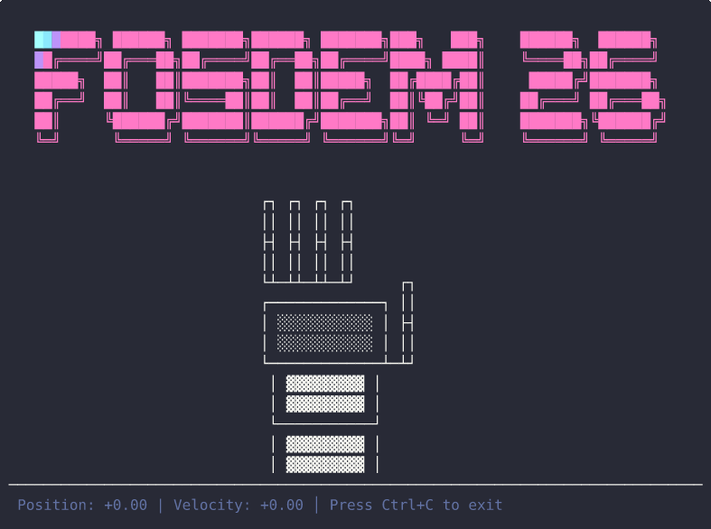

# fosdem26-devtalk-autoapms

Source code for the examples presented at FOSDEM 2026 to demonstrate key features of AutoAPMS.

If you want to learn more, visit the [FOSDEM archive for the talk](https://fosdem.org/2026/schedule/event/RUE39L-auto-apms/).



## Setup

> [!NOTE]
> This assumes you have already installed ROS 2 on your system.

```bash
# Create a workspace
mkdir ~/ros2_ws 
cd ~/ros2_ws
mkdir src

# Clone repo under src
cd src
git clone https://github.com/robin-mueller/fosdem26-devtalk-autoapms.git
cd ..

# Install dependencies
rosdep install --from-paths src --ignore-src
```

## Spawn the demo robot hand

```bash
colcon build --packages-up-to fosdem26_autoapms_robot

source install/local_setup.bash

ros2 run fosdem26_autoapms_robot robot_hand_node.py
```

## Move the robot hand

```bash
colcon build --packages-up-to fosdem26_autoapms_behavior

source install/local_setup.bash

ros2 behavior run fosdem26_autoapms_behavior::wave_left::DoWave --blackboard repeat:=2
```

