<!-- _class: title-academic -->


<div class="title">AutoAPMS: Lightweight and versatile integration of behavior trees into the ROS 2 ecosystem</div>
<div class="subtitle">FOSDEM 2026 Robotics and Simulation</div>
<div class="author" style="margin-top: -20px">Robin Müller</div>
<div class="organization"></div>
<div class="organization">Research Associate | PhD Candidate</div>
<div class="organization">Technical University Darmstadt</div>

<div class="inline-images" style="padding-top: 20px"><div>

[](https://github.com/robin-mueller)

</div><div>

[](https://www.linkedin.com/in/robin-mueller-rm)

</div><div>

[](mailto:mueller@fsr.tu-darmstadt.de)

</div></div>

---

# Why Behavior Trees?

<!-- 
SPEAKER NOTES:
- Set the context: robotics needs hierarchical decision making
- Not everything can be FSMs
- BTs provide modularity, composability and a neat way to model reactivity
-->

<div class="multicolumn vcenter"><div>

Intelligent robotics require **decision making** capabilities and **reactive mechanisms** for

- Navigation in dynamic environments
- Interactive manipulation tasks
- Resilient operations in general

<div class="box">
Behavior trees promise composability, modularity, and reactivity
</div>

</div><div style="padding-left: 40px">

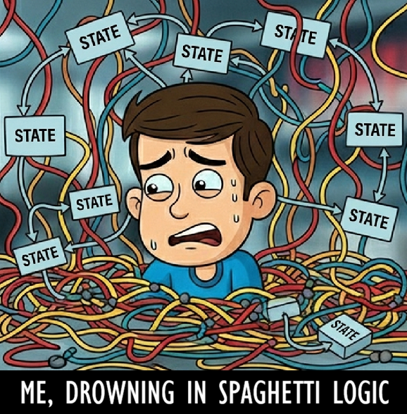

</div></div>

---

<!-- 
SPEAKER NOTES:
- AutoAPMS targets the gap between raw BT.CPP and application development
- Makes C++ BT development as accessible as Python approaches

Problems with existing solutions:
- **Python implementations** → Limited performance, harder ROS 2 integration
- **Manual C++ setup** → High configuration overhead, steep learning curve
- **Domain-specific frameworks** → Not generalizable (e.g., nav2_behavior_tree) 
-->

# Framework Comparison

<style scoped>
section table td {
  line-height: 2.5;
}
section table tr:nth-child(5) {
  background-color: var(--autoapms-primary-soft);
}
</style>

<center>

| ROS 2 Integration | Core Library | Language | Versatility  | Functional Extensibility | Developer Experience | Scalability
|:---|:---|:---:|:---:|:---:|:---:|:---:|
| [py_trees_ros](https://github.com/splintered-reality/py_trees_ros) | [py_trees](https://github.com/splintered-reality/py_trees) | Python | 🟢 | 🟢 | 🟢 | 🟡 |
| [ros2_ros_bt_py](https://github.com/fzi-forschungszentrum-informatik/ros2_ros_bt_py) | *(Monorepo)* | Python | 🟡 | 🟢 | 🟢 | 🟡 |
| [BehaviorTree.ROS2](https://github.com/BehaviorTree/BehaviorTree.ROS2) | [BehaviorTree.CPP](https://github.com/BehaviorTree/BehaviorTree.CPP) | C++ | 🟢 | 🟡 | 🟡 | 🟡 |
| [nav2_behavior_tree](https://github.com/ros-navigation/navigation2/tree/main/nav2_behavior_tree) | [BehaviorTree.CPP](https://github.com/BehaviorTree/BehaviorTree.CPP) | C++ | 🔴 | 🟡 | 🔴 | 🟡 |
| [AutoAPMS](https://github.com/AutoAPMS/auto-apms) | [BehaviorTree.CPP](https://github.com/BehaviorTree/BehaviorTree.CPP) | C++ | 🟢 | 🟢 | 🟢 | 🟢 |

<footnote>🟢 High/Good | 🟡 Medium/Problematic | 🔴 Low/Bad</footnote>

</center>

---

# AutoAPMS Design Goals

<!-- 
SPEAKER NOTES:
- BehaviorTree.ROS2 exists but provides only basic integration
- Still requires manual registration, configuration, and deployment
- Behavior Trees in C++ still lack quality of life features compared to Python counterparts
-->

<div class="multicolumn vcenter" style="gap: 30px"><div>

1. **Domain-agnostic C++ development framework** for behavior-based control and automated planning

1. **Reduced configuration overhead** and lower entry barrier

1. **Focus on modularity and reusability** for distributed workspaces and large projects

</div><div>

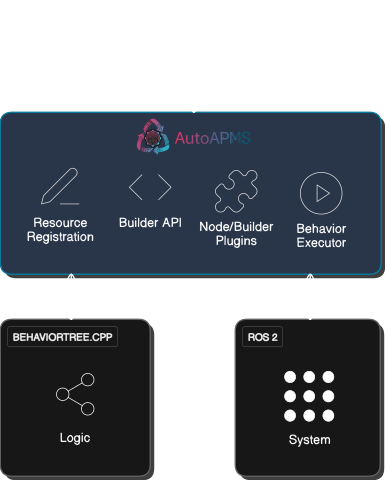

</div></div>

---

<!-- _class: chapter -->


# So how does it work?
## Technical walkthrough

---

# Robot Architecture

<div class="multicolumn vcenter"><div style="width: 400px">

<center>

Behavior Trees represent **policies/plans**

<br>

They utilize the robot's capabilities through **clients/nodes**

</center>

</div><div>

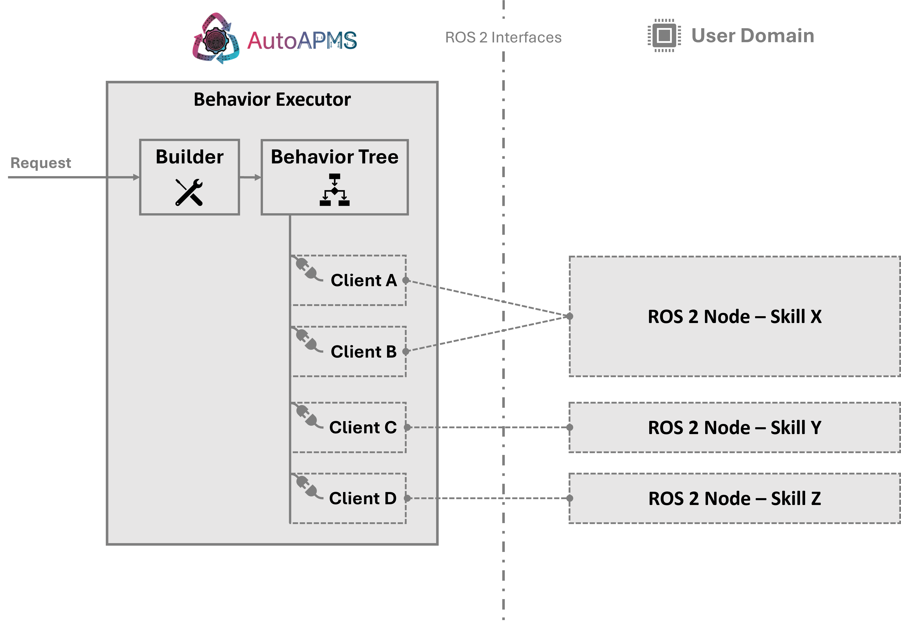

</div></div>

---

# Behavior: Wave Hand

<!-- Overview of robot that "moves a hand" (visualized in the terminal) -->
<!-- The robot has a write-only velocity and a read-only position interface for its arm -->
<!-- In the following we implement a demo that creates a "wave behavior" by using the velocity interface (write) and the position interface (read)  -->

<div class="multicolumn vcenter" style="gap: 20px"><div>

<div class="container" style="padding-top: 10px; padding-bottom: 10px">

**Sensor** 
for reading hand position

```txt
float64 position
```

</div>

<br>

<div class="container" style="padding-top: 10px; padding-bottom: 10px">

**Actuator** 
for moving hand translationally

```txt
float64 velocity
```

</div>

</div><div>

<center>

receive
$\longleftarrow$

<br><br><br><br>

send
$\longrightarrow$

</center>

</div><div>


</div></div>

---

# The Build Request

<div class="multicolumn vcenter"><div>

### Encoded using [BT.CPP XML schema](https://www.behaviortree.dev/docs/learn-the-basics/xml_format)

```xml
<BehaviorTree ID="DoWave">
  <Sequence>
    <SubTree ID="MoveToEndPosition"/>
    <SkipUnlessUpdated entry="@repeat">
      <SubTree ID="RepeatWave"
               repeat="{@repeat}"/>
    </SkipUnlessUpdated>
    <SubTree ID="MoveToCenterPosition"/>
  </Sequence>
</BehaviorTree>
```

</div><div>

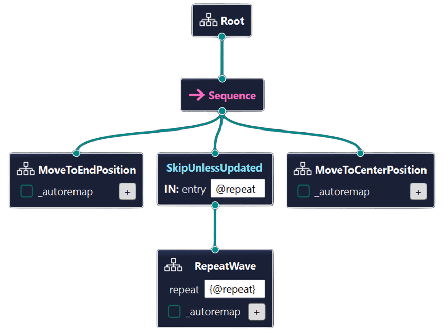 

</div></div>

<!-- Which nodes do we need to put inside the subtrees? -->

---

# The Node Manifest

<center>

**Two underlying implementations** are made reusable through YAML configurations

</center>

<style scoped>
section pre {
  font-size: 12.5pt;
}
</style>

<div class="multicolumn"><div>


```yaml
MoveToTheSide:
  class_name: fosdem26_autoapms_behavior::VelocityPub
  topic: /robot/velocity_cmd
  port_default:
    # Negative for moving left - positive for right
    velocity: -1.0
```

</div><div>

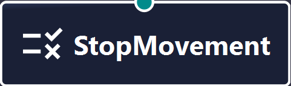

```yaml
StopMovement:
  class_name: fosdem26_autoapms_behavior::VelocityPub
  topic: /robot/velocity_cmd
  port_default:
    # Zero velocity to stop the hand
    velocity: 0.0
```

</div></div>

<div class="multicolumn" style="font-size: 12pt"><div>


```yaml
HandReachedEndPosition:
  class_name: fosdem26_autoapms_behavior::PositionInRange
  topic: /robot/position
  port_default:
    # Negative for end on the left - positive for right
    low: -1.0
    high: -0.95
```

</div><div>


```yaml
HandIsCentered:
  class_name: fosdem26_autoapms_behavior::PositionInRange
  topic: /robot/position
  port_default:
    # Centered around 0.0
    low: -0.1
    high: 0.1
```

</div></div>

---

# The Node Manifest

<style scoped>
section pre {
  font-size: 16pt;
}
</style>

<div class="multicolumn vcenter" style="gap: 25px"><div>

1. Register reusable C++ implementations

    ```cmake
    auto_apms_behavior_tree_register_nodes(
      behavior_tree_nodes  # Target library
      "fosdem26_autoapms_behavior::VelocityPub"
      "fosdem26_autoapms_behavior::PositionInRange"
    )
    ```

2. Register specific manifests for your use-case

    ```cmake
    set(SIDE left)  # and/or right
    auto_apms_behavior_tree_register_nodes(
      wave_${SIDE}  # Alias for node manifest
      NODE_MANIFEST
      "config/common_nodes.yaml"
      "config/wave_${SIDE}_nodes.yaml"
    )
    ```

</div><div style="font-size: 19pt; padding-top: 10px; padding-bottom: 10px; width: 450px">

#### Easy configuration using 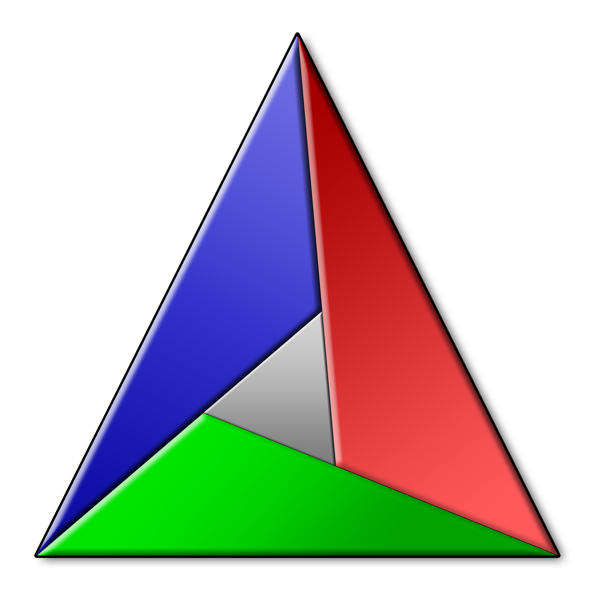 CMake macros in an `ament_cmake` package

#### **Key benefits:**

- Workspace-wide reusable node registrations
- Compile-time validation avoids runtime errors
- Automatic node model generation

  → XML file for visual editors
  → C++ header for builder API

</div></div>

---

# Deploying the Behavior Tree

<style scoped>
section pre {
  font-size: 16pt;
}
</style>

**Registration:** Two behaviors — One definition

```cmake
auto_apms_behavior_tree_register_trees(
  "behavior/tree/generic_wave.xml"
  ALIAS_NAMESPACE wave_${SIDE}
  NODE_MANIFEST "fosdem26_autoapms_behavior::wave_${SIDE}"
)
```

**Deployment:** `ros2 behavior` CLI tool

```bash
ros2 behavior run <package>::<namespace>::<tree> --blackboard <key>:=<value> ...
```

<div style="font-size: 18pt; margin-top: 10px">

`<package>` &ensp; &nbsp;Name of registering package

`<namespace>` Namespace defined during registration

`<tree>` &emsp; &emsp; Behavior Tree ID from XML definition

</div>

---

# Deploying the Behavior Tree

<div class="multicolumn vcenter" style="gap: 20px"><div>

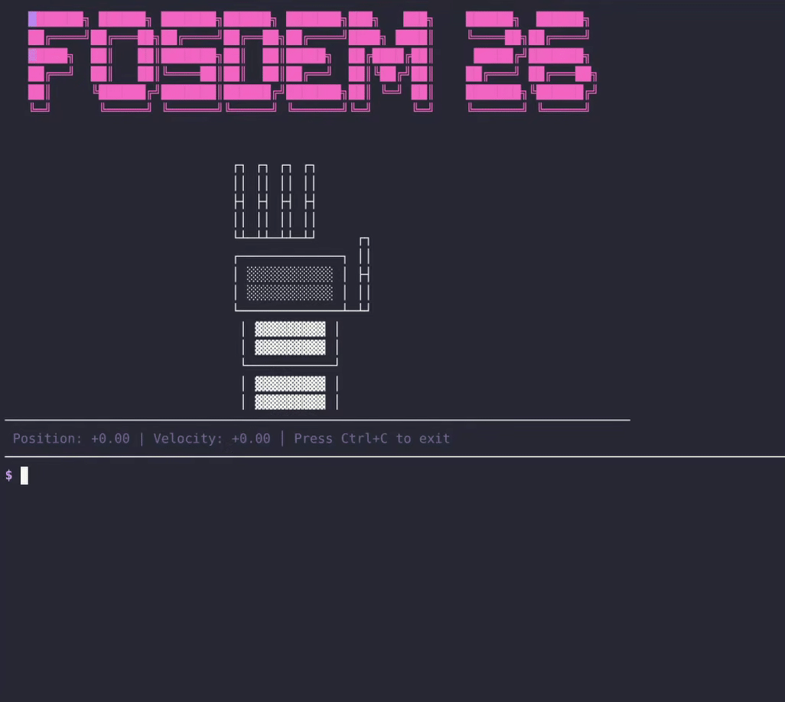

</div><div style="width: 540px">

**Deployment:**
Wave left
```bash
ros2 behavior run \
  fosdem26_autoapms_behavior::wave_left::DoWave \
  --blackboard repeat:=2
```
Wave right
```bash
ros2 behavior run \
  fosdem26_autoapms_behavior::wave_right::DoWave \
  --blackboard repeat:=2
```

</div></div>

---

<!-- _class: chapter -->


# Customizable Behavior Generation
## More than just plain behavior trees

---

# Customizable Behavior Generation

<!-- Highly flexible behavior definition. Multiple ways to customize the build pipeline -->
<!-- User has freedom of designing the pipeline according to his needs but is also responsible for maintaining consistency -->

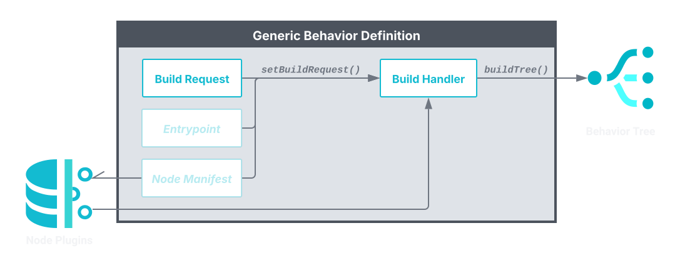

<!-- "Node Manifest" and "Build Handler" are core concepts that we should have a closer look at -->

---

# The Build Handler

<div class="multicolumn vcenter" style="gap: 40px"><div>

<box style="padding: 0px 30px">

### **Concept Idea**

User-defined behavior tree generation logic

</box>

What if we want the hand to move like this?
***Left → Left → Right → Right → Left → Right***

## → New build request message format

- `l` means left — `r` means right
- E.g. `l;l;r;r;l;r`

</div><div>

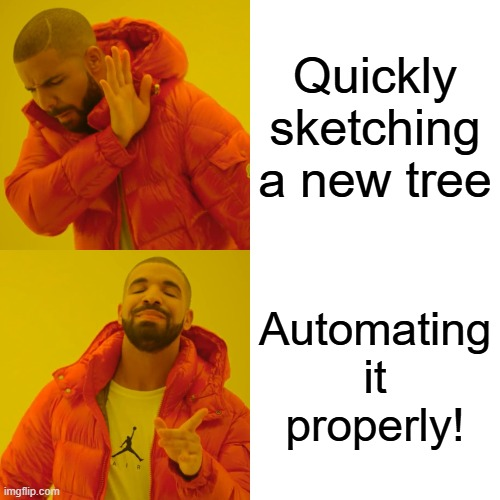

</div></div>

---

# C++ Behavior Tree Builder API

<style scoped>
section pre {
  font-size: 16pt;
}
</style>

1. Load predefined subtrees
    ```cpp
    TreeDocument doc, doc_left, doc_right;
    doc_left.newTreeFromResource("fosdem26_autoapms_behavior::wave_left::MoveToEndPosition")
      .setName("MoveLeft");
    doc_right.newTreeFromResource("fosdem26_autoapms_behavior::wave_right::MoveToEndPosition")
      .setName("MoveRight");
    ```
2. Create the custom tree by parsing the build request
    ```cpp
    TreeDocument::TreeElement tree = doc.newTree("CustomBehavior").makeRoot();
    model::Sequence sequence = tree.insertNode<model::Sequence>();
    for (const std::string dir : auto_apms_util::splitString(build_request, ';')) {
      if (dir == "l") 
        sequence.insertSubTreeNode(doc_left.getTree("MoveLeft"));
      else if (dir == "r")
        sequence.insertSubTreeNode(doc_right.getTree("MoveRight"));
    }
    return tree;
    ```

---

# Deploying Custom Behavior Definitions

<style scoped>
section pre {
  font-size: 16pt;
}
</style>

**Registration:** Register build handler and assign to behavior

```cmake
auto_apms_behavior_tree_register_build_handlers(
  custom_build_handler  # Target library
  "fosdem26_autoapms_behavior::CustomBuilder"
)
auto_apms_behavior_tree_register_behavior(
  "l;l;r;r;l;r"  # May also be defined at runtime
  ALIAS "custom_wave"
  BUILD_HANDLER "fosdem26_autoapms_behavior::CustomBuilder"
  CATEGORY "custom"
)
```

**Deployment:** `ros2 behavior` CLI tool

```txt
ros2 behavior run <package>::<alias>
```

<div style="font-size: 17pt; margin-top: 10px">

`<package>` Name of registering package `<alias>` Behavior alias defined during registration

</div>

---

# Deploying Custom Behavior Definitions

<div class="multicolumn vcenter" style="gap: 20px"><div>

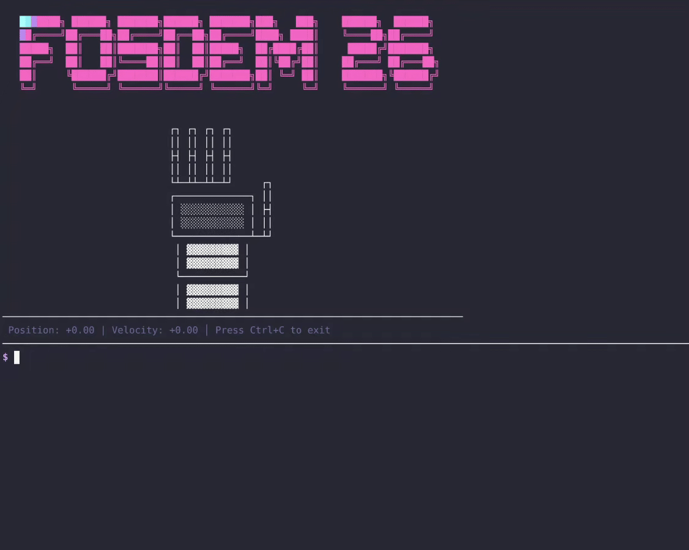

</div><div style="width: 500px">

<style scoped>
section pre {
  font-size: 15pt;
}
</style>

**Deployment:**
Static resource
```bash
ros2 behavior run \
  fosdem26_autoapms_behavior::custom_wave
```
Dynamic request
```bash
ros2 behavior run \
  --build-request "l;l;r;r;l;r" \
  --build-handler fosdem26_autoapms_behavior::CustomBuilder
```

</div></div>

---

# Runtime-Configurable Executor

<!-- Not only static behavior resources but dynamically interpreted -->
<!-- Ready for you to tailor to your specific needs -->

<center>

## ROS 2 Action

</center>

<div class="multicolumn" style="margin: 0px 170px; gap: 100px"><div>

```txt
string build_request
string build_handler
string entry_point
string node_manifest
```

</div><div style="display: flex; flex-direction: column; justify-content: flex-end;">

```txt
uint8 tree_result  
```

</div></div>

<div class="multicolumn vcenter" style="gap: 0px"><div>

<center>

### Goal &ensp; $\downarrow$

</center>

</div><div>

<center>

### $\uparrow$ &ensp; Result

</center>

</div></div>

<center>

<box style="padding: 10px 40px">

### Many behavior definitions — One powerful ROS 2 Node

`ros2 run auto_apms_behavior_tree tree_executor`

</box>

</center>

---

# Now on ROS Index 🎉

<div class="multicolumn vcenter"><div style="width: 700px; margin-bottom: 20px; text-align: left">

### Core tools
```bash
sudo apt install ros-$ROS_DISTRO-auto-apms-behavior-tree
```

### ROS 2 CLI integration
```bash
sudo apt install ros-$ROS_DISTRO-auto-apms-ros2behavior
```

<br>

<div class="container" style="text-align: center">

### Give it a try and streamline your ROS 2 project with AutoAPMS!

</div>

</div>

[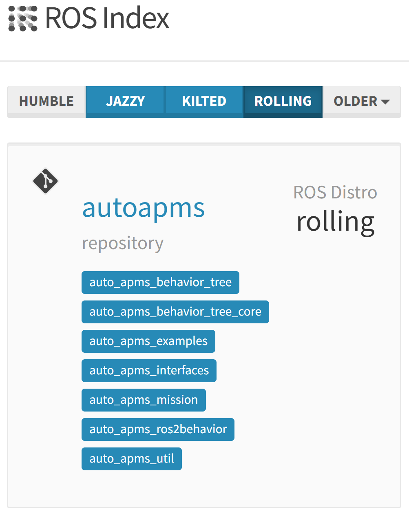](https://index.ros.org/r/autoapms/)

---

# Coming Soon

<div class="multicolumn vcenter" style="gap: 10px"><div>

[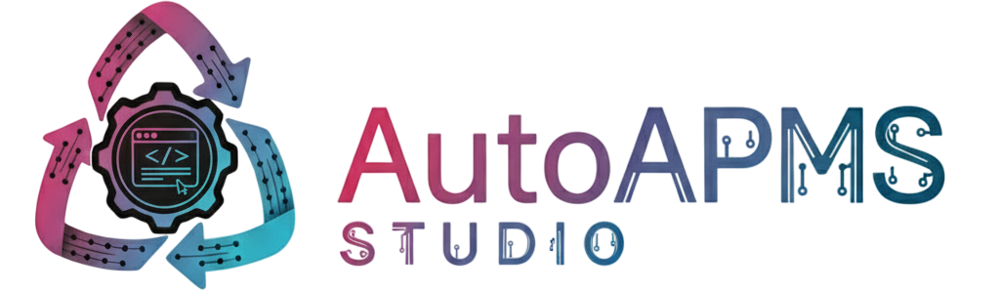](https://github.com/AutoAPMS/auto-apms-studio)

</div><div>

[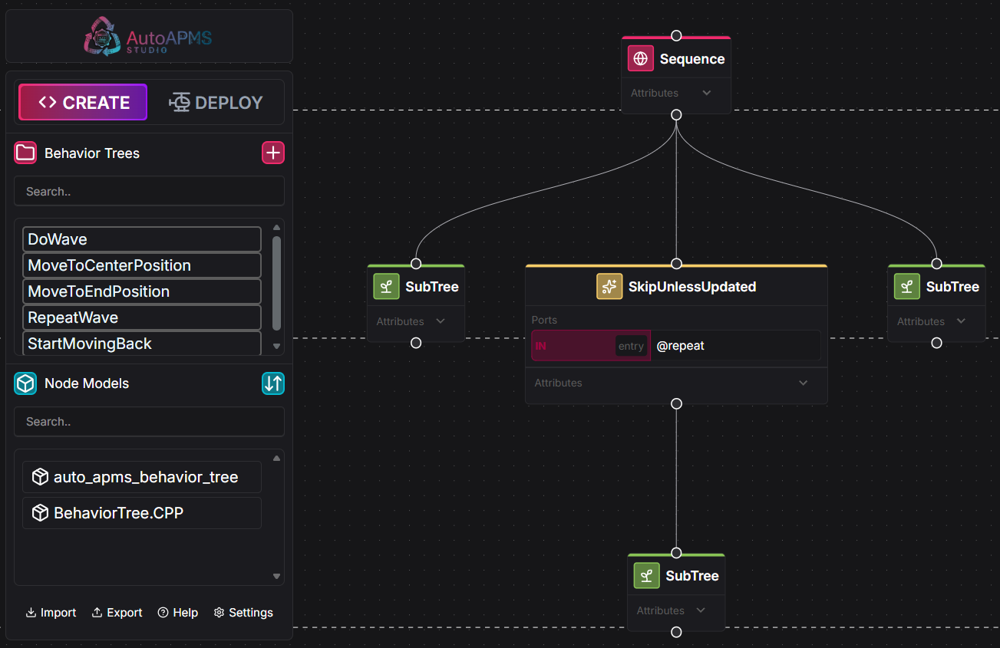](https://github.com/AutoAPMS/auto-apms-studio)

</div></div>

---

<!-- _class: title-academic -->


<div class="title">Thank You</div>
<div class="subtitle">FOSDEM 2026 Robotics and Simulation</div>

<div class="inline-images" style="margin-top: -30px; padding-left: 10px"><div>

[](https://github.com/AutoAPMS/auto-apms)

</div><div>

*Full example code on GitHub*
[fosdem26-devtalk-autoapms](https://github.com/robin-mueller/fosdem26-devtalk-autoapms)

</div></div>

<div class="inline-images" style="padding-left: 10px"><div>

[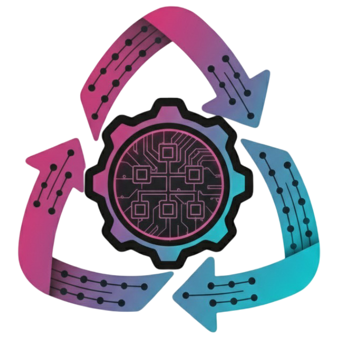](https://autoapms.github.io/auto-apms-guide/)

</div><div>

*User Guide & API Docs*
[autoapms.github.io/auto-apms-guide](https://autoapms.github.io/auto-apms-guide/)

</div></div>

<div class="inline-images" style="padding-left: 10px"><div>

[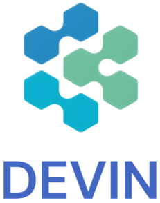](https://deepwiki.com/AutoAPMS/auto-apms)

</div><div>

*AI Generated Docs & Interactive Guide*
[deepwiki.com/AutoAPMS/auto-apms](https://deepwiki.com/AutoAPMS/auto-apms)

</div></div>

---

<!-- _paginate: false -->
<!-- _header: "" -->
<!-- _footer: "" -->

<style>
.space-adjust {
    padding: 50px 0px;
}
</style>

<div class="box">This work has been funded by the LOEWE initiative (Hesse, Germany) within the emergenCITY center [LOEWE/1/12/519/03/05.001(0016)/72]</div>

<div class="space-adjust"></div>

<div class="multicolumn vcenter"><div align="center">

[](https://www.tu-darmstadt.de/)

</div><div align="center">

[](https://www.fsr.tu-darmstadt.de/)

</div><div align="center">

[](https://www.emergencity.de//)

[](https://www.emergencity.de//)

</div></div>

